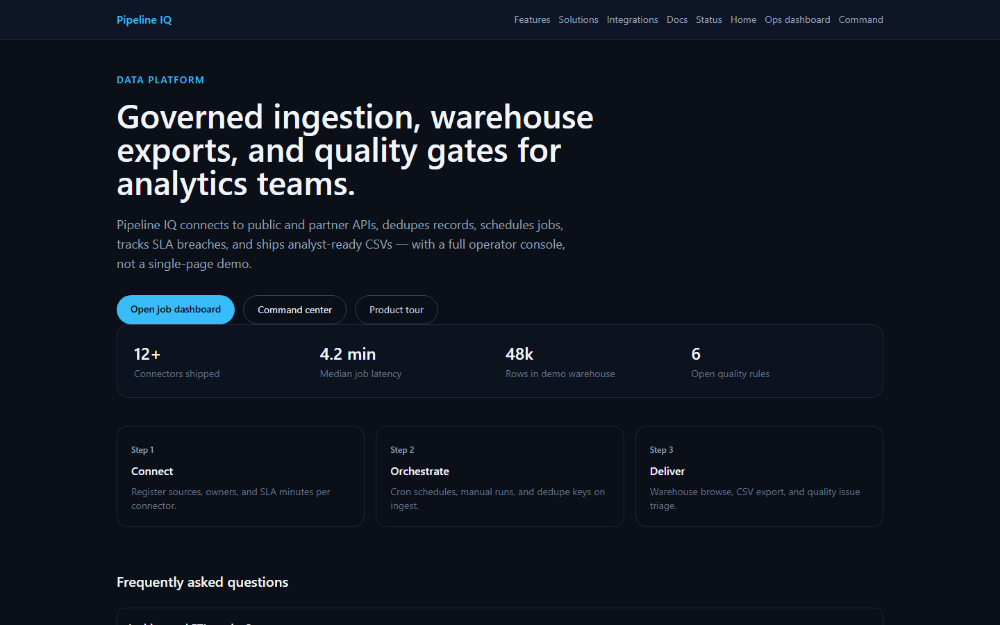
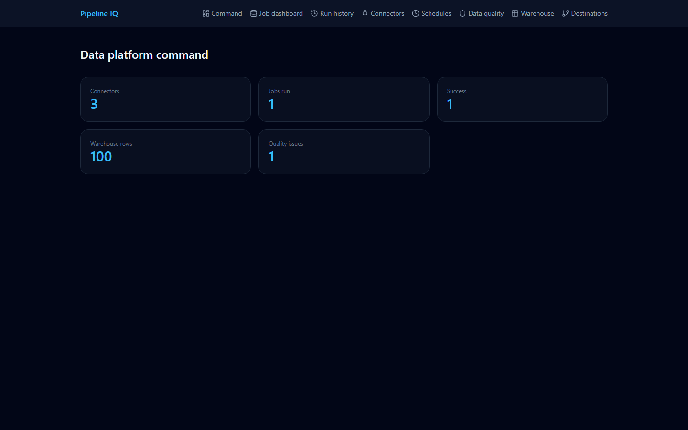
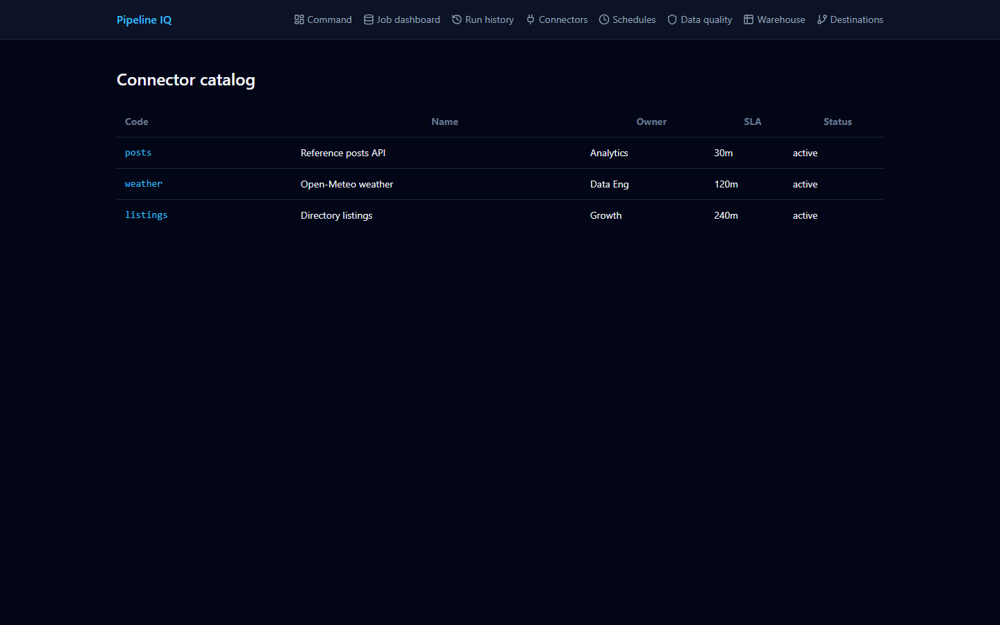
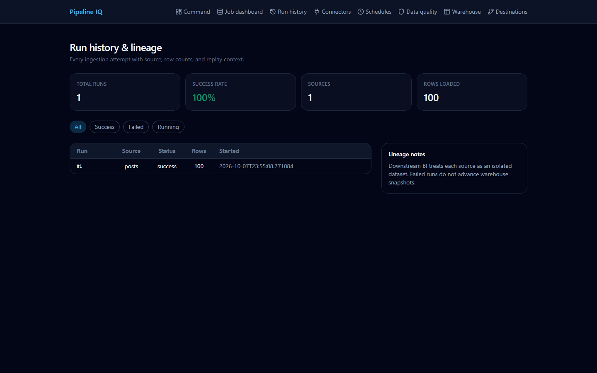
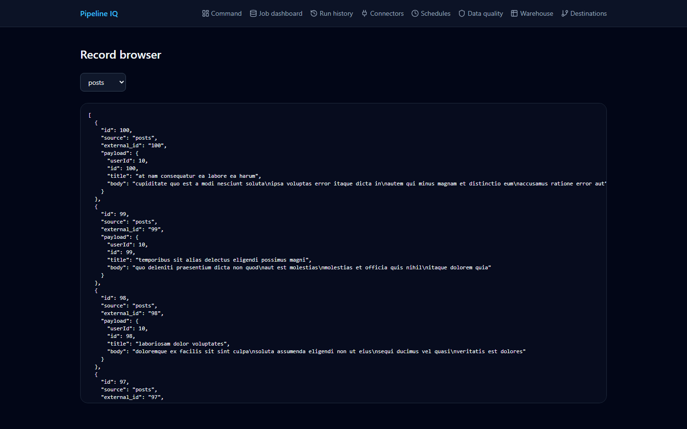
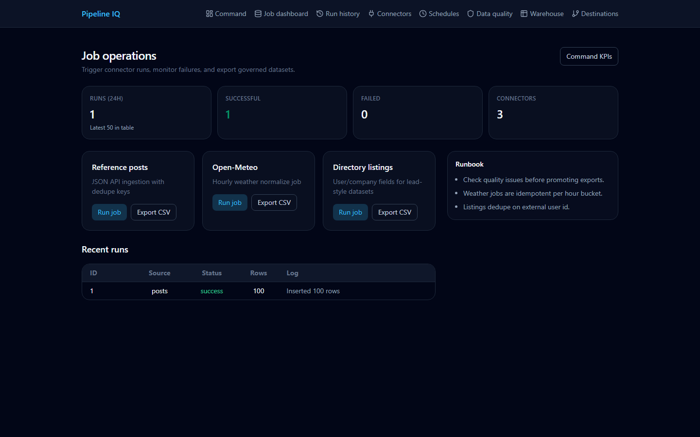

# Pipeline IQ — data pipeline console








FastAPI data-engineering app: connectors, schedules, job runs, a warehouse records browser, data-quality checks and destinations, with a Vite + React console.

## Modules

http://localhost:3013

| Module | Route |
|--------|--------|
| Job dashboard | `/ops` |
| Command | `/console` |
| Connectors | `/console/connectors` |
| Schedules | `/console/schedules` |
| Jobs | `/console/jobs` |
| Data quality | `/console/quality` |
| Destinations | `/console/destinations` |
| Warehouse browser | `/records` |

Public pages (`/`, `/features`, `/solutions`, `/integrations`, `/docs`, `/status`, `/trust`, `/catalog`) are served by the same web app.

## Tech stack

| Area | Technologies |
|------|--------------|
| Frontend | `React`, `TypeScript`, `Vite`, `Ant Design Pro Components`, `Tailwind CSS`, `Zustand`, `React Router` |
| Backend | `Python`, `FastAPI`, `pandas`, `Pydantic Settings` |
| Database | `SQLAlchemy (async)`, `SQLite (aiosqlite)` |
| Auth | `JWT (python-jose)`, `passlib`, `bcrypt` |
| DevOps and tooling | `Docker`, `pytest`, `oxlint` |

## Run

Setup (once):

```powershell
cd backend
python -m venv .venv
.\.venv\Scripts\pip install -r requirements.txt
copy .env.example .env
cd ..\web
copy .env.example .env
npm install
```

Then from the repo root:

```powershell
.\run.ps1
```

`run.ps1` starts the API (`src.main:backend_app`, port **8013**) in a new window and the web app on port **3013** with `VITE_API_BASE=http://localhost:8013`. It uses `backend\.venv` when present, otherwise the `python` on your PATH.

Delete `backend\data\harvester.db` after schema changes.

Scraper worker example: see `scrapers/README.md`.

## Tests

```powershell
cd backend
.\.venv\Scripts\pip install -r requirements-dev.txt
.\.venv\Scripts\python -m pytest
```

Uses FastAPI `TestClient` against an isolated temp SQLite database (seeded demo data): health, command overview, connectors/schedules, job list and invalid-source rejection.

## Author

**Alexsandro Sunaga**

## License

MIT License — see [LICENSE](LICENSE).
